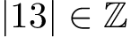

# 基本規則
LaTeX 檔案以純文字儲存（副檔名為 `.tex`），其中以特定語法來描述生成檔案的結構、內文、樣式。排版引擎會讀取檔案裡面的語法產生相應的文檔內容。

這個部分會寫到 LaTeX 這個標記式電腦語言的基本規則。

## 空格
LaTeX 中空格與 Tab（定位字元）都被視為空格，並且多個空格與一個空格沒有差異。一個單獨的換行也會被視為空格；而多個換行在文字之間（有一個以上的空行）則會將文字分隔為不同的段落。

因為 LaTeX 檔案裡面的空格與輸出文件的空格並不是直接對應的，所以我們可以利用這一點來整理原始碼以便我們閱讀及修改。例如：
<table>
<tr><th>LaTeX<td>

```
輸入一個 空格或
多個     空格
並沒有任何差別。

而一個空行則會開始一個新的段落。
```

<tr><th>輸出<td>

```
輸入一個 空格或 多個 空格 並沒有任何差別。

而一個空行則會開始一個新的段落。
```
</table>

## 特殊字元
LaTeX 檔案以純文字構成，而其中一些字元（`#` `$` `%` `^` `&` `_` `{` `}` `~` `\`）對排版引擎來說有特殊功能，它們可能還會與其他文字結合成一些有特殊意義的指令來代表某些排版規則。

### 反斜線 `\`
反斜線是 LaTeX 中最常見到的特殊字元，它會與它之後的文字合併成一個 LaTeX 指令。某些特殊字元也可以使用反斜線來輸出，例如用 `\$` 輸出 `$`。

### 花括號 `{ }`
花括號在 LaTeX 裡面通常用來把文字包成一個整體，例如在數學環境中 `x^23` 對應 *x*²3、 `x^{23}` 對應 *x*²³。

## 指令
LaTeX 的指令以反斜線 `\` 開始，後面緊接著指令的名稱。有的指令會有一個以上必填的參數，每個參數都必須按順序各自放在花括號 `{ }` 之中；有的指令會有額外的選項能夠調整，要調整的時候必須將需要的選項用逗號分隔放在方括號 `[ ]` 之中。完整格式如下：
```tex
\command[option1,option2]{argument1}{argument2}
```

### 自訂指令
除了內建及第三方套件提供的指令之外，我們也可以用 `\newcommand` 來自訂指令。透過自訂指令我們可以把經常用到的文字語句（也能包含某些指令）全部包裝成一個單一指令，方便我們後續使用。如果是已經被定義過的指令，我們也能用 `\renewcommand` 來重新定義。格式如下：
```tex
\newcommand{\name}{definition}
\renewcommand{\name}{definition}
```
其中的 `\name` 是之後使用會用到的指令，而 `definition` 則是該指令的內容。自訂的指令也可以設定需要輸入的參數（以方括號宣告），而要在 `definition` 利用傳入的參數時，則按順序用 `#1`、`#2`…表示。格式如下：
```tex
\newcommand{\name}[num]{definition}
```

例如在數學環境中
<table>
<tr><th>LaTeX<td>

```tex
\newcommand{\Int}{\mathbb{Z}}
\newcommand{\abs}[1]{\left| #1 \right|}

\abs{13} \in \Int
```
<tr><th>輸出<td>


</table>

## 環境
環境（Environment）是 LaTeX 裡面的特殊結構，以 `\begin{name}` 開始，以 `\end{name}` 結束（其中的 `name` 是環境名稱）。大部分的環境裡面都可以再放入其他的環境或指令。環境裡面的內容通常會有特殊的排版規則，能搭配環境特定的符號或指令來達成更複雜的排版設定。
```tex
\begin{name}
  有特殊排版規則的內容
\end{name}
```

## 註解
LaTeX 使用 `%` 字元做單行的註解，任何出現在 `%` 之後的文字都會在輸出時被忽略。我們可以利用這點來為原始碼加上說明。而事實上，LaTeX 排版引擎看到 `%` 字元時不只會忽略同一行之後的文字，還包括換行以及下一行開頭的所有空格。這讓我們可以在原始碼中換行，卻又不會輸出空白。（這種用法通常只是為了讓我們更好閱讀原始碼而已）例如：
<table>
<tr><th>LaTeX<td>

```tex
abcdefghijkl%
       mnopqrs%
tuvwxyz
```

<tr><th>輸出<td>

```
abcdefghijklmnopqrstuvwxyz
```
</table>

### 多行註解
LaTeX 並沒有提供多行註解的功能，不過還是有方法能達到同樣的功效。其中一個做法就是利用 `\iffalse` 條件結構，這種恆為非的特殊條件結構會讓排版引擎直接跳過被包住的內容。例如：
```tex
\iffalse
  這裡面的東西會被跳過
\fi
```

-------------
[首頁](README.md)

