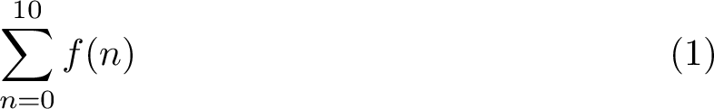

# 數學
強大的數學排版能力是 LaTeX 的一大特點。在數學的式子裡面，就算是同樣的文字符號，不同的大小、字型、位置都會讓它代表的意思產生差別。

這個部分會寫到有關於數學排版的各種東西。

## 套件
LaTeX 內建的指令對簡單的數學排版已經很完美了，但面對更加專業的需求，我們就必須引用一些套件來做更多更強大的設定。常見的數學相關套件有下列幾個：

| 名稱      | 功能 |
|:---------:|------|
|`amsmath`  | 各式各樣的數學功能，基本上是必須引用的套件 |
|`amssymb`  | 各式各樣的數學符號與字體，包含黑板粗體（或叫雙線體）`\mathbb` |
|`amsthm`   | 提供跟定理排版有關的功能 |
|`mathtools`| 算是 `amsmath` 的擴充，引用它會自動引用 `amsmath` |
|`stmaryrd` | 更多符號 |

## 數學環境
數學排版會需要數學環境，數學環境裡的每一個文字符號都會以適合數學排版的樣式來輸出。數學式在數學環境中的輸出分成兩種樣式：**文字樣式**、**展示（Displayed）樣式**，文字樣式會限制數學式符號的大小，讓高度盡可能地壓縮在一個行高內，較適合與普通文字一起做排版；而一般的數學式多半以展示樣式呈現，除了美觀以外也比較能看清楚式子裡的細節。排版時我們可以用 `\textstyle` 與 `\displaystyle` 強制切換樣式。

數學環境的格式就像在[〈基本規則〉](../basics.md)裡面提到的環境一樣，而 LaTeX 有內建三個基本的數學環境：`math`、`displaymath`、`equation`，其中前兩個環境在 LaTeX 中有簡寫的指令讓我們更方便地使用。

### `math` 環境：行內數學式
簡寫指令是在數學式的左右包著 `$`（如：`$1+1=2$`）。

這個數學環境在排版時會跟著內文一起排列，預設以**文字樣式**呈現數學式，讓我們可以在行文裡面插入簡單的數學式。

### `displaymath` 環境：展示數學式
簡寫指令是在數學式的前後分別包著 `\[` 與 `\]`（如：`\[1+1=2\]`）。

這個數學環境在排版時會製造獨立單行的數學區塊，預設以**展示樣式**呈現數學式。

### `equation` 環境：編號數學式
這個數學環境在排版時除了會製造獨立單行的數學區塊，還會幫數學式按順序編號，預設以**展示樣式**呈現數學式。我們也可以讓它不編號，只要把環境改成 `equation*`，但這就跟 `displaymath` 沒兩樣了。例如：
<table>
<tr><th>LaTeX<td>

```tex
\begin{equation}
  \sum_{n=0}^{10} f(n)
\end{equation}
```

<tr><th>輸出<td>


</table>

除了上述內建於 LaTeX 中的數學環境，我們還可以引用其他第三方套件（通常是 `amsmath`）來使用其他功能更強大的數學環境，這些環境可能會提供多行與對齊定位的功能。

- [其他數學環境](math_environments.md)
- [數學符號](math_symbols.md)
- 定理
- 矩陣

-------------
[首頁](../README.md)

