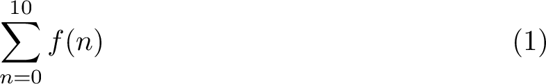

# 數學
強大的數學排版能力是 LaTeX 的一大特點。在數學的式子裡面，就算是同樣的文字符號，不同的大小、字型、位置都會讓它代表的意思產生差別。

這個部分會寫到有關於數學排版的各種東西。

## 套件
LaTeX 內建的指令對簡單的數學排版已經很完美了，但面對更加專業的需求，我們就必須引用一些套件來做更多更強大的設定。常見的數學相關套件有下列幾個：

| 名稱      | 功能 |
|:---------:|------|
|`amsmath`  | 各式各樣的數學功能，基本上是必須引用的套件 |
|`amssymb`  | 各式各樣的數學符號與字體，包含黑板粗體（或叫雙線體）`\mathbb` |
|`amsthm`   | 提供跟定理排版有關的功能 |
|`mathtools`| 算是 `amsmath` 的擴充，引用它會自動引用 `amsmath` |
|`stmaryrd` | 更多符號 |

## 數學環境
數學排版會需要數學環境，在數學環境裡面每一個文字符號都會有適合數學排版的字型與間距，某些特殊的數學環境還會提供其他的定位功能。

數學式在數學環境中的輸出分成兩個樣式：**文字樣式**、**展示（Displayed）樣式**，文字樣式會限制數學式符號的大小，讓高度盡可能地壓縮在一個行高內，較適合與普通文字一起做排版；而一般的數學式多半以展示樣式呈現，除了美觀以外也比較能看清楚式子裡的細節。排版時我們可以用 `\textstyle` 與 `\displaystyle` 強制切換樣式。

### 行內數學式
在數學式的左右包著 `$`（如：`$1+1=2$`）可以製造行內的數學環境，它在輸出時預設以**文字樣式**呈現數學式，讓你可以在行文裡面插入簡單的數學式。

### 展示數學式
在數學式的左右分別包著 `\[` 與 `\]`（如：`\[1+1=2\]`）會製造獨立的單行數學環境，它在輸出時預設以**展示樣式**呈現數學式。

### 特殊數學環境
除了上面提到的兩種基本的數學環境，大多數的數學環境格式就像在[〈基本規則〉](../basics.md)裡面提到的環境一樣。這些數學環境也會製造獨立的空間做數學排版，輸出時預設以**展示樣式**呈現。不同的環境有不同的功能，他們有的能讓你放入多行數學式、對齊定位、數學式編號之類的功能。

例如最簡單的單行數學環境 `equation`，注意輸出時會自動添加編號在右邊（如果不想要編號可以使用 `equation*` 環境）：
<table>
<tr><th>LaTeX<td>

```tex
\begin{equation}
  \sum_{n=0}^{10} f(n)
\end{equation}
```

<tr><th>輸出<td>


</table>

- 其他數學環境
- 數學符號
- 定理
- 矩陣

