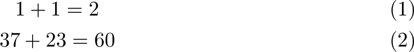

**LaTeX 筆記**｜[首頁](../README.md)｜[數學](math.md)

-------------

# 數學環境
這個部分會寫到除了內建環境以外的各種常用數學環境。這裡提到的環境都需要先引用第三方套件 `amsmath` 才可使用。

## `gather` 環境：多行
這個數學環境在排版時會製造獨立多行的數學區塊，以 `\\` 分行。例如
<table>
<tr><th>LaTeX<td>

```tex
\begin{gather}
  1 + 1 = 2 \\
  37 + 23 = 60
\end{gather}
```

<tr><th>輸出<td>


</table>


`gather` 環境會把每一行數學式都編號，我們可以在換行符號 `\\` 前面加上 `\nonumber` 或 `\notag` 指令來表示不編號某行。另外就像是 `equation` 有不編號的版本 `equation*`，`gather` 也有不編號的版本 `gather*`。例如
<table>
<tr><th>LaTeX<td>

```tex
\begin{gather}
  7 + 6 = 13 \nonumber \\
  7 - 6 = 1
\end{gather}
```

<tr><th>輸出<td>


</table>

## `align` 環境：多行、對齊
這個數學環境我想是最常使用的環境了。它在排版時會製造獨立多行的數學區塊，除了能以 `\\` 分行，還可以用 `&` 表示定位點來讓不同行的數學式在某個符號上對齊。比如要將連續的等式在等號的位置對齊，我們可以在 `=` 前面加上 `&`，例如
<table>
<tr><th>LaTeX<td>

```tex
\begin{align}
  1 + 1 &= 2 \\
  7 + 6 &= 13 \\
  37 + 23 &= 60
\end{align}
```

<tr><th>輸出<td>


</table>

一行可以不只有一個 `&`。我們可以理解成，用 `&` 把一行行分割成表格，每個直排分別以靠右對齊、靠左對齊、靠右對齊、靠左對齊…這樣不斷輪流。例如
<table>
<tr><th>LaTeX<td>

```tex
\begin{align}
  1+1   &= 2  & 1-1   &= 0 \\
  7+6   &= 13 & 7-6   &= 1 \\
  37+23 &= 60 & 37-23 &= 14
\end{align}
```

<tr><th>輸出<td>


</table>

另外，`align` 環境也可以使用 `\nonumber` 和 `\notag`，也有完全不編號的 `align*` 環境。

-------------

**LaTeX 筆記**｜[首頁](../README.md)｜[數學](math.md)

