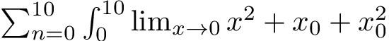
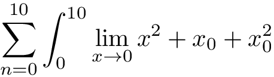

**LaTeX 筆記**｜[首頁](../README.md)｜[數學](math.md)

-------------

# 數學符號
這個部分會寫到各種常用的數學符號。所有的數學符號都必須在數學環境中使用，而這裡提到的符號有些可能需要先引用第三方套件（如 `amssymb`）才可使用。

### 目錄
- [字體](#字體)
  - [多字母函數](#多字母函數)
- [字母](#字母)
  - [希臘字母](#希臘字母)
  - [其他字母](#其他字母)
- [位置](#位置)
  - [空格](#空格)
  - [上下標](#上下標)
  - [分數](#分數)
  - [二項式係數](#二項式係數)
- [符號](#符號)
  - [二元運算](#二元運算)
  - [關係](#關係)
  - [邏輯](#邏輯)
  - [大符號](#大符號)
  - [箭頭](#箭頭)
  - [括號](#括號)
  - [點點點](#點點點)

## 字體
數學式裡面就算是同樣的字母，不同的字體往往代表不同的意思。常用的幾個列表如下（示意的部分以實際輸出為準）

> ※ 雖然 Unicode 有收錄相關不同字體的符號給數學使用（[數學字母數字符號](https://zh.wikipedia.org/wiki/數學字母數字符號)），不過在 LaTeX 裡面我們一般還是會用指令來輸入。

類別     | LaTeX | 示意  | 說明
:-------:|-------|-------|-------
一般     |       | *ABC* *abc* 123 | 斜體字母、正體數字
羅馬體   | `\mathrm{…}`   | ABC abc 123 | 正體
義大利體 | `\mathit{…}`   | *ABC* *abc* *123* | 斜體
粗體     | `\mathbf{…}`   | **ABC abc 123** |
無襯線體 | `\mathsf{…}`   | 𝖠𝖡𝖢 𝖺𝖻𝖼 𝟣𝟤𝟥 | 沒設定的話，上面的一般都會是襯線體
等寬體   | `\mathtt{…}`   | `ABC abc 123` |
哥德體   | `\mathfrak{…}` | 𝔄𝔅ℭ 𝔞𝔟𝔠 | 數字沒有歌德體
書寫體   | `\mathcal{…}`  | 𝒜ℬ𝒞 | 只有大寫字母
黑板粗體 | `\mathbb{…}`   | 𝔸𝔹ℂ | 雙線體，只有大寫字母，須引用 `mathsymb` 套件

### 多字母函數
一般來說，多字母的函數應該使用羅馬體來表示。大部分常用的函數已經內建好了，常用的條列如下：
- 三角函數： `\sin`、`\cos`、`\tan`…
  - 反三角函數： `\arcsin`、`\arccos`、`\arctan`…
  - 雙曲函數： `\sinh`、`\cosh`、`\tanh`
- 指對數：`\exp`、`\log`、`\ln`
- 上下界：`\max`、`\min`、`\sup`、`\inf`
- 極限： `\lim`
- 最大公因數： `\gcd`
- 同餘： `\mod`、`\pmod`、`\bmod`
- 其他： `\dim`、`\deg`、`\det`、`\ker`

如果函數沒有被 LaTeX 或第三方套件定義，我們可以使用 `\DeclareMathOperator` 指令來定義。這個指令有 2 個參數，第一個參數是以後使用時要輸入的指令，第二個參數是輸出時顯示的文字。例如要，我們可以如下定義最小公因數：

```tex
\DeclareMathOperator{\lcm}{lcm}
```

## 字母

> ※ 雖然 Unicode 有收錄這些字母，不過在 LaTeX 裡面我們一般還是會用指令來輸入。

### 希臘字母
數學裡面除了拉丁字母，我們還常常會用到希臘字母。希臘字母一般都直接用名字做指令，指令第一個字母的大小寫決定輸出的大小寫（如果大寫長得跟拉丁字母一模一樣，直接輸入拉丁字母就好）；如果小寫要不同的版本，可以在指令前面加上 `var`。詳細列表如下：

大寫 | LaTeX | 小寫 | LaTeX | var | LaTeX
:---:|-------|:----:|-------|:---:|-------
Α | A          | α | `\alpha`
Β | B          | β | `\beta`
Γ | `\Gamma`   | γ | `\gamma`
Δ | `\Delta`   | δ | `\delta`
Ε | E          | ϵ | `\epsilon` | ε | `\varepsilon`
Ζ | Z          | ζ | `\zeta`
Η | H          | η | `\eta`
Θ | `\Theta`   | θ | `\theta`   | ϑ | `\vartheta`
Ι | I          | ι | `\iota`
Κ | K          | κ | `\kappa`   | ϰ | `\varkappa`
Λ | `\Lambda`  | λ | `lambda`
Μ | M          | μ | `\mu`
Ν | N          | ν | `\nu`
Ξ | `\Xi`      | ξ | `\xi`
Ο | O          | ο | o          |   | omicron
Π | `\Pi`      | π | `\pi`      | ϖ | `\varpi`
Ρ | P          | ρ | `\rho`     | ϱ | `\varrho`
Σ | `\Sigma`   | σ | `\sigma`   | ς | `\sigma`
Τ | T          | τ | `\tau`
Υ | `\Upsilon` | υ | `\upsilon`
Φ | `\Phi`     | ϕ | `\phi`     | φ | `\varphi`
Χ | X          | χ | `\chi`
Ψ | `\Psi`     | ψ | `\psi`
Ω | `\Omega`   | ω | `\omega`

### 其他字母

符號 | LaTeX | 符號 | LaTeX | 符號 | LaTeX | 符號 | LaTeX
:---:|-------|:----:|-------|:----:|-------|:----:|-------
ı | `\imath` | ȷ | `\jmath`  | ∂ | `\partial` | ∇ | `\nabla`
ℜ | `\Re`    | ℑ | `\Im`     | ℵ | `\aleph`   | ℶ | `\beth`
∞ | `\infty` | ∅ | `\empty`* | ∅ | `\vernothing`*

> [*] 空集合符號，前面的比較窄，像 0；後面的須引用 `amssymb` 才可使用。

## 位置
### 空格
一般來說 LaTeX 或其他第三方套件已經幫我們把很多符號的間距設定好了，但有時候我們可能還是會需要自己設定，LaTeX 提供了很多指令來表示空格。列表如下：

LaTeX    | 大小
---------|-------
`\ `     | （有空格在斜線後）一般文字的空格
`\qquad` | `\quad` × 2
`\quad`  | 數學字體大小
`\;`     | `\quad` × 5/18
`\:`     | `\quad` × 4/18
`\,`     | `\quad` × 3/18
`\!`     | `\quad` × -3/18


### 上下標
我們使用 `^` 表示上標、用 `_` 表示下標。上下標也可以配合符號使用，但出現的位置可能會依照輸出的樣式（文字、展示）而有差別，例如
<table>
<tr><th>LaTeX<td>

```tex
\sum_{n=0}^{10} \int_{0}^{10} \lim_{x \to 0} x^2 + x_2
```

<tr><th>文字樣式<td>



<tr><th>展示樣式<td>


</table>

### 根號
我們用 `\sqrt` 指令來表示根號，它有 1 個參數。如果是多次根號（如 ∛），次方數則表示在指令的選項裡，例如 `\sqrt[3]{27}` 代表 27 的 3 次根。

### 分數
我們用 `\frac` 指令來表示分數，它有 2 個參數，第一是分子，第二是分母。文字樣式的分數會整個縮小，我們可以用 `\tfrac`、`\dfrac` 強制使用文字樣式、展示樣式（須引用 `amsmath`）。

就算是分數整體是使用展示樣式，分子分母的部分也會因為空間不夠而變成文字樣式。雖然可以使用 `\displaystyle` 轉換成展示樣式，但在表示連分數的時還是很麻煩，這個時候我們可以用 `\cfrac` 指令（須引用 `amsmath`），它在排版時不會壓縮分子分母的空間。

### 二項式係數
我們用 `\binom` 指令來表示二項式係數（須引用 `amsmath`），它有 2 個參數。同樣有強制樣式的版本 `\tbinom`、`\dbinom`。


## 符號

> ※ 雖然 Unicode 有收錄這些符號，不過在 LaTeX 裡面我們一般還是會用指令來輸入。

### 二元運算

符號 | LaTeX | 符號 | LaTeX | 符號 | LaTeX | 符號 | LaTeX
:---:|-------|:----:|-------|:----:|-------|:----:|-------
\+ | +        | - | -         | × | `\times` | ÷ | `\div`
±  | `\pm`    | ∓ | `\mp`     | ⋅ | `\cdot`  | ∘ | `\circ`
⊕  | `\oplus` | ⊗ | `\otimes` | ∧ | `\wedge` | ∨ | `vee`
∩  | `\cap`   | ∪ | `\cup`    | ∖ | `\setminus`

### 關係
下列幾種關係符號都可以在前面加上 `\not` 來表示「非」，輸出時會在符號上畫一撇。

符號 | LaTeX | 符號 | LaTeX | 符號 | LaTeX | 符號 | LaTeX
:---:|-------|:----:|-------|:----:|-------|:----:|-------
=  | =         | ≠ | `\neq`    | ≡  | `\equiv`    | ≔ | `\coloneqq`*
≅  | `\cong`   | ~ | `\sim`    | ≈  | `\approx`
\> | >         | < | <         | ≥  | `\geq`      | ≤ | `\leq`
⊃  | `\supset` | ⊂ | `\subset` | ⊇  | `\supseteq` | ⊆ | `\subseteq`
∈  | `\in`     | ∉ | `\notin`  | \| | `\mid`      | ∥ | `\parallel`

> [*] 須引用 `mathtools` 才可使用。

### 邏輯

符號 | LaTeX | 符號 | LaTeX | 符號 | LaTeX
:---:|-------|:----:|-------|:----:|-------
¬ | `\neg`     | ∧ | `\land`     | ∨ | `\lor`
∃ | `\exists`  | ∀ | `\forall`   | → | `\to`
∵ | `\because` | ∴ | `\therefore`

### 大符號

符號 | LaTeX | 符號 | LaTeX | 符號 | LaTeX | 符號 | LaTeX
:---:|-------|:----:|-------|:----:|-------|:----:|-------
∑ | `\sum`    | ∏ | `\prod`   | ∫ | `\int`      | ∮ | `\oint`
⋂ | `\bigcap` | ⋃ | `\bigcup` | ⊕ | `\bigoplus` | ⊗ | `\bigotimes`

### 箭頭

符號 | LaTeX | 符號 | LaTeX | 符號 | LaTeX
:---:|-------|:----:|-------|:----:|-------
→ | `\rightarrow` | ← | `\leftarrow` | ↔ | `\leftrightarrow`
⇒ | `\Rightarrow` | ⇐ | `\Leftarrow` | ⇔ | `\Leftrightarrow`
↑ | `\uparrow`    | ↓ | `\downarrow` | ↦ | `\mapsto`

### 括號
下面幾種括號都可以在前面使用 `\big`、`\Big`、`\bigg`、`\Bigg` 增加大小；也可以在左右括號的前面分別加上 `\left` 與 `\right`，它會自動判斷裡面的內容調整大小。

符號 | LaTeX | 符號 | LaTeX | 符號 | LaTeX | 符號 | LaTeX
:---:|-------|:----:|-------|:----:|-------|:----:|-------
( | `(`       | ) | `)`       | \[ | `[`       | ] | `]`
{ | `\{`      | } | `\}`      | \| | `\|`      | ‖ | `\\|`
⟨ | `\langle` | ⟩ | `\rangle`
⌈ | `\lceil`  | ⌉ | `\rceil`  | ⌊  | `\lfloor` | ⌋ | `\rfloor`

### 點點點
符號 | LaTeX | 符號 | LaTeX | 符號 | LaTeX | 符號 | LaTeX
:---:|-------|:----:|-------|:----:|-------|:----:|-------
… | `\dots` | ⋯ | `\cdots` | ⋮ | `\vdots` | ⋱ | `ddots`

-------------

**LaTeX 筆記**｜[首頁](../README.md)｜[數學](math.md)

